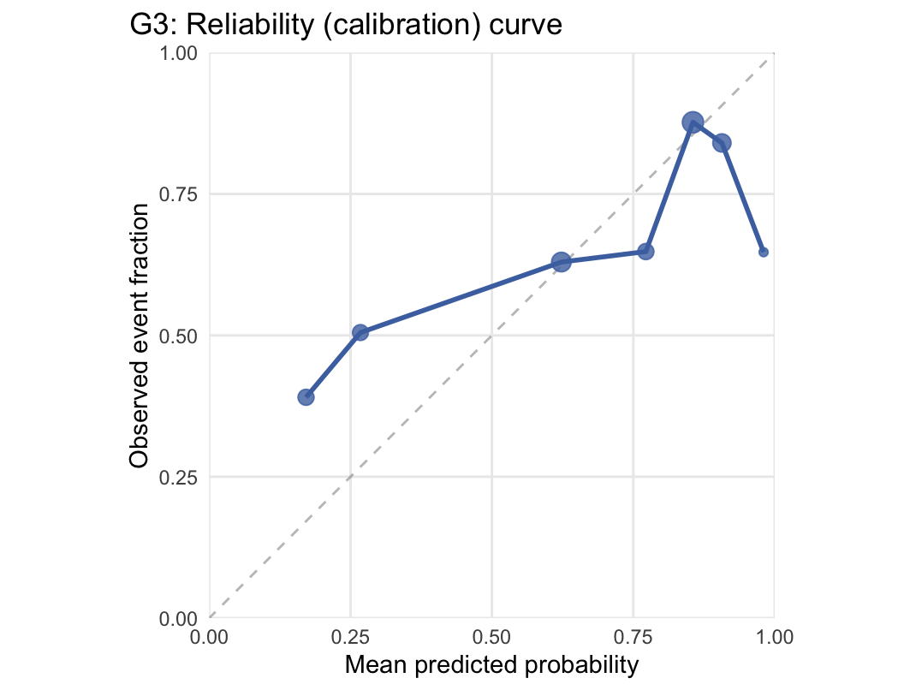
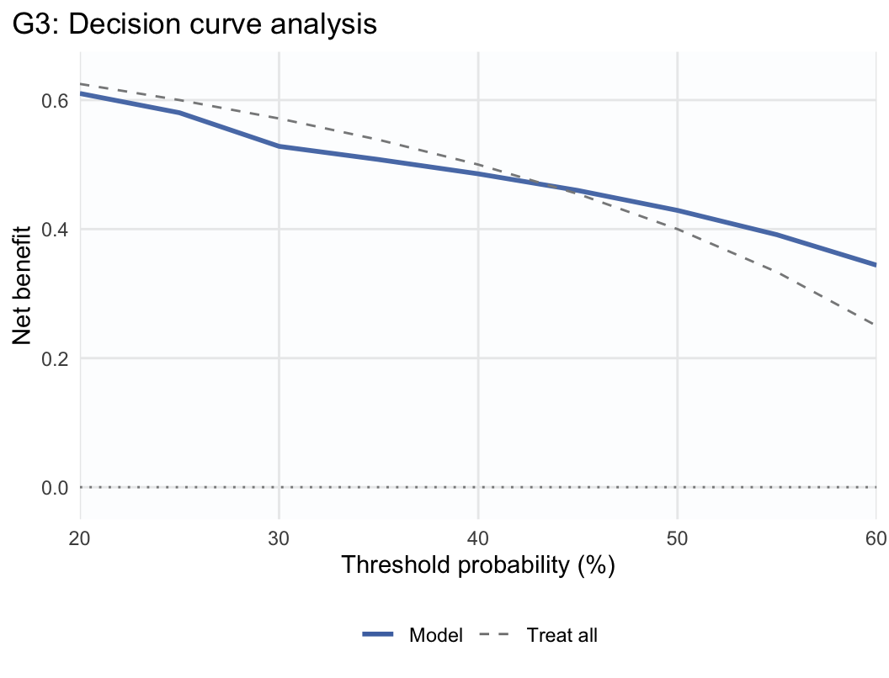
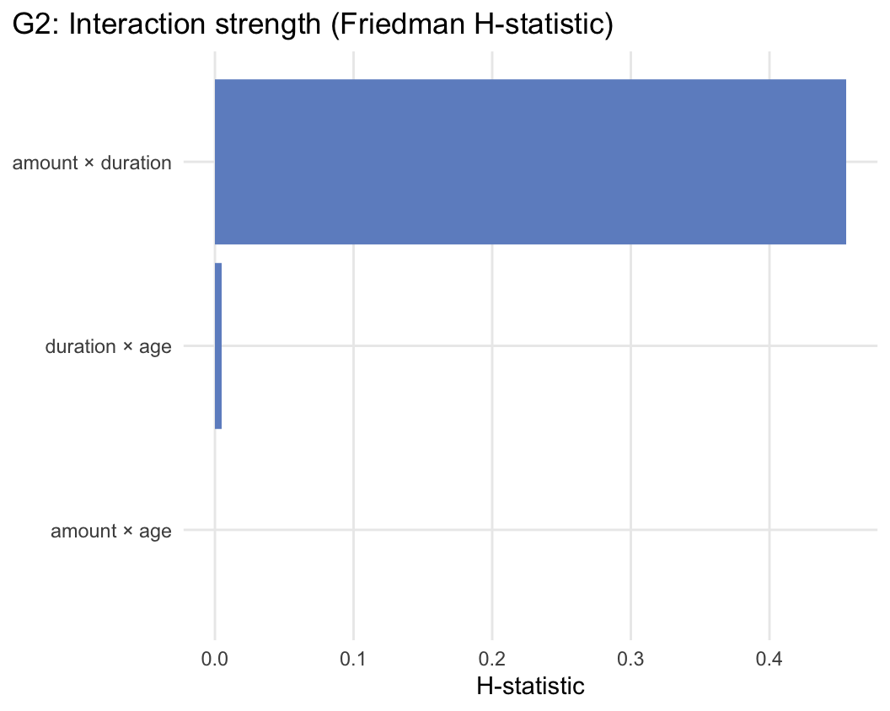
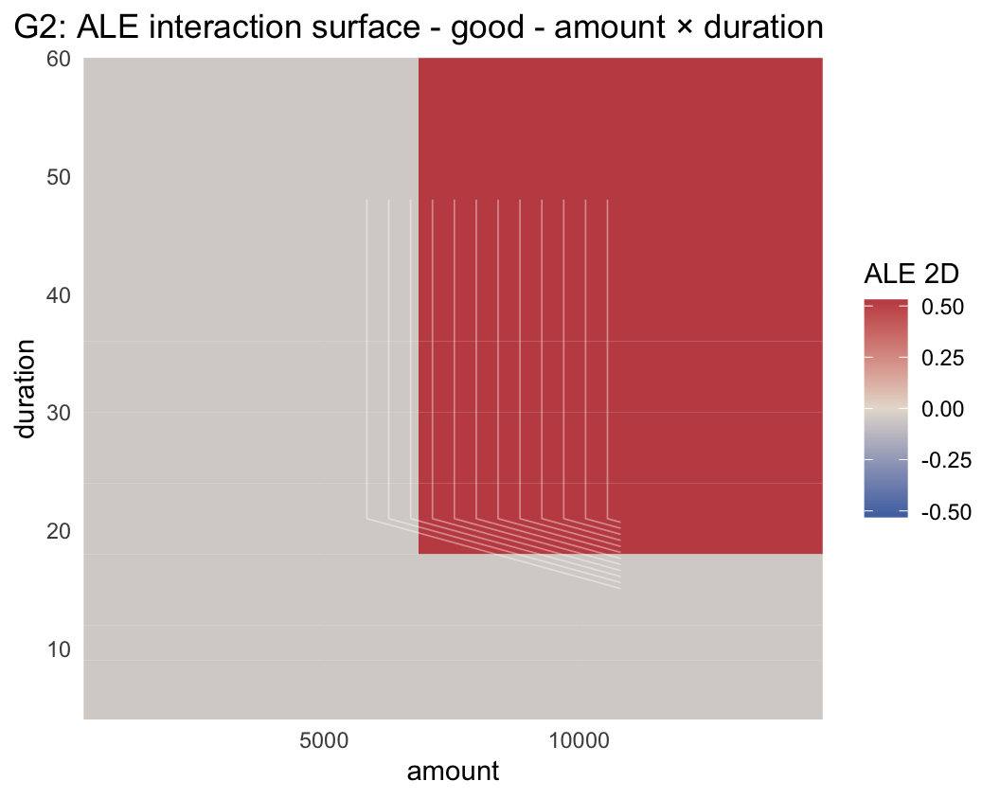
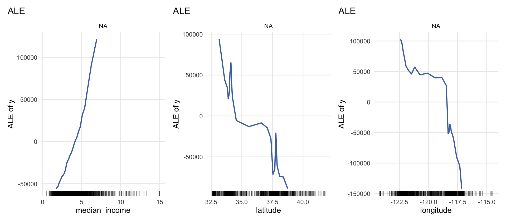
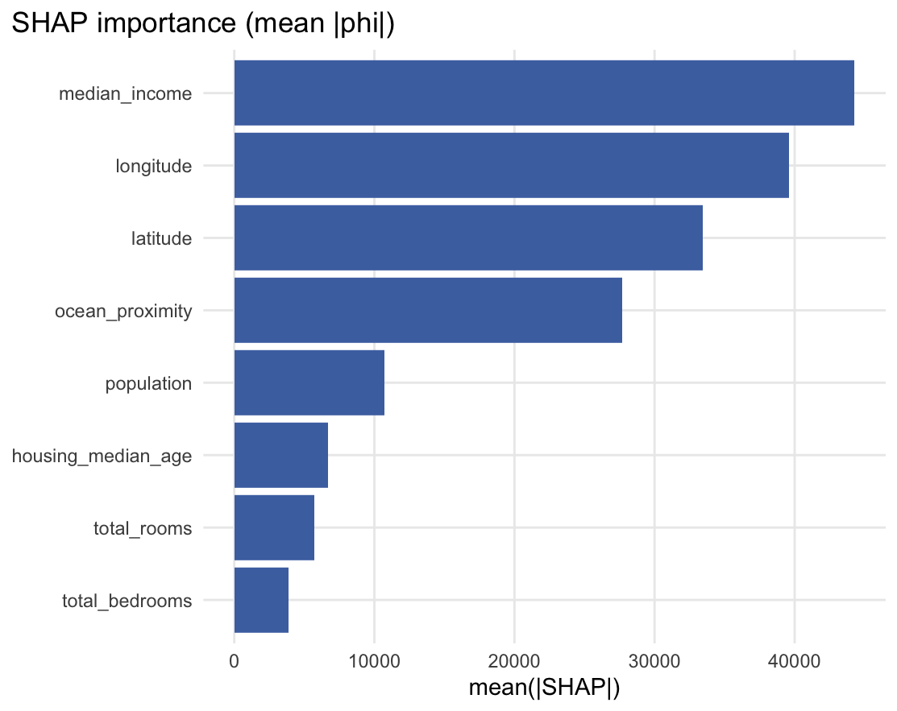
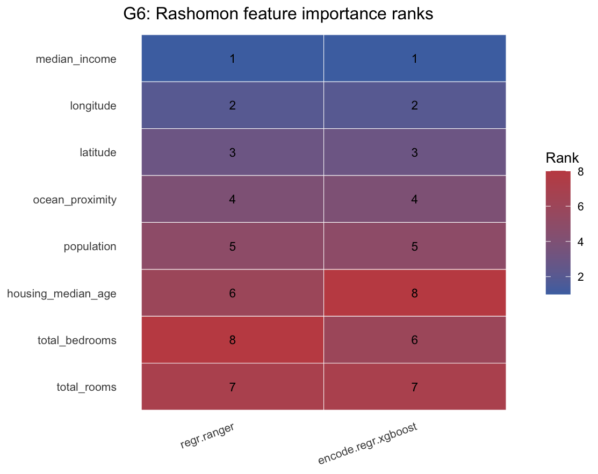

<!-- README.md is generated from README.Rmd. Please edit that file -->

# mlr3autoiml

`mlr3autoiml` is an **auditing and automation layer** for interpretable
machine learning (IML) on top of the **mlr3 ecosystem**. It implements a
**gate-based workflow** (G0A/G0B → G1 → G2 → G3 → G4 → G5 → G6 →
G7A/G7B) and assigns **claim-scoped Interpretation Evidence Levels
(IEL-0…3)** that scope the strength of permissible interpretive claims.

Core dependencies: `mlr3`, `mlr3measures`, `mlr3misc`, `data.table`,
`checkmate`, `R6`. Optional integrations (pipelines, SHAP, iml,
plotting) activate when the corresponding packages are available.

## Installation

``` r
# install.packages("remotes")
remotes::install_github("coorsaa/mlr3autoiml")
```

------------------------------------------------------------------------

## Example 1 — Classification · decision support

**Task:** `german_credit` (1 000 rows, 20 mixed-type features, binary
`credit_risk`). Full gate path including G3 calibration + decision
utility and G7A subgroup audit.

``` r
library(mlr3)
library(mlr3autoiml)
library(mlr3learners)
library(mlr3pipelines)

task = tsk("german_credit")
task$set_col_roles("personal_status_sex", add_to = "group")

learner = lrn("classif.rpart", predict_type = "prob", maxdepth = 6L)
```

The next block is deliberately tutorial-like. The `ctx$claim` entries
are not learned from the data, and they are not outputs of the model.
They are pre-analysis declarations that formalize what kind of claim is
being requested. For your own work, a practical shortcut is to answer
five questions before fitting anything: who is the target population,
what use is intended, what uses are out of scope, where should
interpretation stop, and why is this threshold or utility framing
reasonable? In this benchmark example, the wording is illustrative
rather than authoritative, but the structure is the same one you would
use in a real audit.

``` r
auto = AutoIML$new(
  task = task,
  learner = learner,
  resampling = rsmp("cv", folds = 3),
  purpose = "decision_support",
  seed = 42
)

auto$ctx$claim = make_claim_card(
  purpose = "decision_support",
  semantics = "within_support",
  stakes = "medium",
  claims = list(global = TRUE, local = FALSE, decision = TRUE),
  decision_spec = list(
    thresholds = seq(0.20, 0.60, by = 0.05),
    utility = list(tp = 1, fp = -0.5, fn = -1, tn = 0)
  ),
  target_population = "Loan applicants in the German Credit benchmark population",
  setting = "Illustrative credit-risk screening benchmark",
  time_horizon = "Single application review",
  transport_boundary =
    "Interpretation limited to applicants similar to the benchmark sample and the declared subgroup structure",
  intended_use = "Support analyst review of credit-risk screening decisions.",
  intended_non_use = "Not for automated approval, denial, or enforcement.",
  prohibited_interpretations = "Causal claims; individual enforcement decisions.",
  decision_policy_rationale =
    paste(
      "Thresholds reflect a conservative screening range where missed high-risk cases",
      "are costlier than extra manual review."
    )
)

auto$ctx$measurement = make_measurement_card(
  level = "item",
  missingness_plan = "Use the benchmark task encoding as provided.",
  reliability =
    list(note = "Observed benchmark variables are treated as recorded inputs rather than latent scales."),
  invariance =
    list(status = "not-applicable", note = "Subgroup comparisons are descriptive audits of observed benchmark fields."),
  scoring_pipeline = "Use the provided encoded predictors and binary outcome without additional score construction."
)
auto$ctx$sensitive_features = "personal_status_sex"
auto$ctx$alt_learners = list(
  featureless = lrn("classif.featureless", predict_type = "prob")
)
auto$ctx$multiplicity$transport_mode = "group_performance"
```

The measurement card is declared for the same reason. It documents how
we are treating the variables, missingness, and subgroup comparisons,
rather than pretending those assumptions can be inferred from the fitted
model.

``` r
res = auto$run()
```

``` r
knitr::kable(auto$report_card()[, .(gate_id, gate_name, status, summary)])
```

| gate_id | gate_name | status | summary |
|:---|:---|:---|:---|
| G0A | Scope claim & use | pass | Claim scope set (global=TRUE, local=FALSE, decision=TRUE) with semantics=within_support. |
| G0B | Measurement readiness | pass | Measurement readiness screened (requires user-supplied psychometric evidence; missingness summarized). |
| G1 | Modeling and data validity (preflight) | pass | Predictive adequacy established with honest resampling. |
| G2 | What is being summarized? (dependence & interactions) | warn | Claim semantics=“within_support”: dependence and/or heterogeneity detected; prefer dependence- and interaction-aware summaries (ALE/ICE + regionalization) and avoid overinterpreting simple global narratives. |
| G3 | Calibration and decision utility | warn | Binary calibration/utility checks computed (intercept/slope, ECE, reliability, net benefit, cost-/utility sweep). |
| G5 | Stability and robustness | pass | Permutation-based stability check suggests robust importance ordering under bootstrap perturbations. |
| G6 | Multiplicity and transport | pass | Multiplicity and transport checks did not raise major concerns (given available evidence). |
| G7A | Subgroups / measurement audit | warn | Subgroup audit computed (binary classification performance + calibration; utility if specified). |

``` r
cat("\nIEL (overall) =", res$iel$overall, "\n")
#> 
#> IEL (overall) = IEL-1
```

With the claim card, measurement notes, and subgroup transport check
filled in, the remaining warnings are substantive rather than
setup-related: calibration, net benefit in the declared threshold range,
and the interaction pattern that makes a simple one-feature story too
thin.

``` r
auto$plot("g3_calibration")
auto$plot("g3_dca")
```



Gate 2 then shows why the package warns instead of presenting a single
global effect curve as the main story: `amount` and `duration` dominate,
and they interact strongly.

``` r
auto$plot("g2_hstats", top_n = 3L)
auto$plot("g2_ale_2d", feature1 = "amount", feature2 = "duration", class_label = task$positive)
```



``` r
export_analysis_bundle(auto, dir = "bundle_german_credit", prefix = "german_credit")
```

------------------------------------------------------------------------

## Example 2 — Regression · global insight

**Task:** `california_housing` (20 433 complete cases from the 20
640-row benchmark, 8 numeric + 1 factor feature, continuous
`median_house_value`). For the README, we keep a complete-case subset so
`ranger`, lasso, and `xgboost` benchmark the same design matrix.
Correlated spatial predictors still trigger ALE selection in G2, and the
mixed learner family makes Gate 6 Rashomon diagnostics realistic.

``` r
task = tsk("california_housing")
task$filter(task$row_ids[stats::complete.cases(task$data())])

learner = lrn(
  "regr.ranger",
  num.trees = 200L,
  mtry.ratio = 0.5,
  min.node.size = 5L
)
```

The same idea applies here. The claim card below is not extra
decoration; it makes the analysis design explicit before Gate 6 compares
models. Because this README uses a complete-case subset, the declared
target population, transport boundary, and missingness plan all refer to
that filtered analysis set. That is the right way to handle these fields
in practice: write down the population and workflow you are actually
analyzing, not the broader one you might wish you had.

``` r
auto = AutoIML$new(
  task = task,
  learner = learner,
  resampling = rsmp("cv", folds = 3),
  purpose = "global_insight",
  seed = 42
)

auto$ctx$claim = make_claim_card(
  purpose = "global_insight",
  semantics = "within_support",
  stakes = "low",
  claims = list(global = TRUE, local = FALSE, decision = FALSE),
  target_population = "Californian housing blocks (1990 census) with complete predictor information",
  setting = "Illustrative housing-value benchmark",
  time_horizon = "Cross-sectional snapshot",
  transport_boundary =
    "Interpretation limited to blocks similar to the observed 1990 census sample after complete-case filtering",
  intended_use = "Identify global drivers of median house value.",
  intended_non_use = "Not for causal policy claims or parcel-level appraisal.",
  prohibited_interpretations = "Causal claims; individual valuation."
)

auto$ctx$measurement = make_measurement_card(
  level = "item",
  missingness_plan =
    "Restrict the README example to complete cases so the mixed learner family shares the same input matrix.",
  reliability =
    list(note = "Observed benchmark variables are treated as recorded inputs rather than latent scales."),
  invariance =
    list(status = "not-applicable", note = "Subgroup comparisons are descriptive audits of observed benchmark fields."),
  scoring_pipeline = "Use the provided encoded predictors and numeric outcome without additional score construction."
)
auto$ctx$sensitive_features = "ocean_proximity"
auto$ctx$alt_learners = list(
  lasso = as_learner(po("encode") %>>% lrn("regr.glmnet", alpha = 1)),
  xgboost = as_learner(
    po("encode") %>>%
      lrn(
        "regr.xgboost",
        nrounds = 150L,
        eta = 0.05,
        max_depth = 6L,
        subsample = 0.8,
        colsample_bytree = 0.8,
        verbose = 0
      )
  ),
  tree = lrn("regr.rpart", maxdepth = 12L, cp = 1e-03),
  featureless = lrn("regr.featureless")
)
auto$ctx$structure$max_features = 8L
```

``` r
res = auto$run()
```

``` r
knitr::kable(auto$report_card()[, .(gate_id, gate_name, status, summary)])
```

| gate_id | gate_name | status | summary |
|:---|:---|:---|:---|
| G0A | Scope claim & use | pass | Claim scope set (global=TRUE, local=FALSE, decision=FALSE) with semantics=within_support. |
| G0B | Measurement readiness | pass | Measurement readiness screened (requires user-supplied psychometric evidence; missingness summarized). |
| G1 | Modeling and data validity (preflight) | pass | Predictive adequacy established with honest resampling. |
| G2 | What is being summarized? (dependence & interactions) | warn | Claim semantics=“within_support”: dependence and/or heterogeneity detected; prefer dependence- and interaction-aware summaries (ALE/ICE + regionalization) and avoid overinterpreting simple global narratives. |
| G5 | Stability and robustness | pass | Permutation-based stability check suggests robust importance ordering under bootstrap perturbations. |
| G6 | Multiplicity and transport | warn | Evidence of multiplicity (Rashomon set contains multiple near-tie models) and/or limited transportability across groups; scope interpretive claims accordingly. |
| G7A | Subgroups / measurement audit | pass | Subgroup audit computed (regression RMSE, R², mean_y by group). |

``` r
cat("\nIEL (overall) =", res$iel$overall, "\n")
#> 
#> IEL (overall) = IEL-1
```

For the README, we widen Gate 2 slightly so the effect plots include the
more interpretable housing variables that dominate the model story:
income and coastal location. Using `ranger` as the fitted model keeps
the global effects readable, while Gate 6 benchmarks it against lasso,
`xgboost`, and a single tree baseline.

``` r
auto$plot("g2_effect", feature = c("median_income", "latitude", "longitude"))
```



The supporting views below add two complementary angles: conditional
SHAP importance for the fitted tree, and a Rashomon rank heatmap for the
near-tie models in Gate 6.

``` r
auto$plot("shap_importance", n_rows = 40L, sample_size = 15L, background_n = 40L, top_n = 8L)
auto$plot("g6_rank_heatmap", top_n = 8L)
```



``` r
export_analysis_bundle(auto, dir = "bundle_california", prefix = "california")
```

------------------------------------------------------------------------

## Gate overview

| Gate | Triggered when | Evidence checks |
|----|----|----|
| G0A | always | Claim and semantics declaration; hard-stop on `causal_recourse` without identification |
| G0B | always | Measurement readiness; reliability / invariance evidence for high-stakes |
| G1 | always | CV performance + calibration snapshot |
| G2 | always | Feature dependence · ALE vs PDP selection · pairwise interaction screening |
| G3 | `claims$decision = TRUE` | Calibration curve + Decision Curve Analysis |
| G4 | `claims$local = TRUE` | SHAP faithfulness + perturbation sensitivity checks |
| G5 | always | Stability of narrated patterns under bootstrap resampling |
| G6 | high-resolution profile | Rashomon multiplicity + transport probes |
| G7A | `sensitive_features` set | Subgroup performance + calibration audit |
| G7B | user-facing + high-stakes | Human-factors (task-based evaluation) evidence |

IELs (0–3) are assigned per claim scope (global / local / decision). The
overall IEL is the minimum across all requested scopes.

## Status

The package follows a claim-first, gate-based architecture with explicit
semantics, claim-scoped IELs, and evidence-driven gate planning. Default
runs use the `high_resolution` profile; `quick_start = TRUE` is
available for rapid prototyping. IEL-3 requires G6 evidence across all
scopes and, for decision claims, a passed G7A subgroup audit.

## License

LGPL-3.
