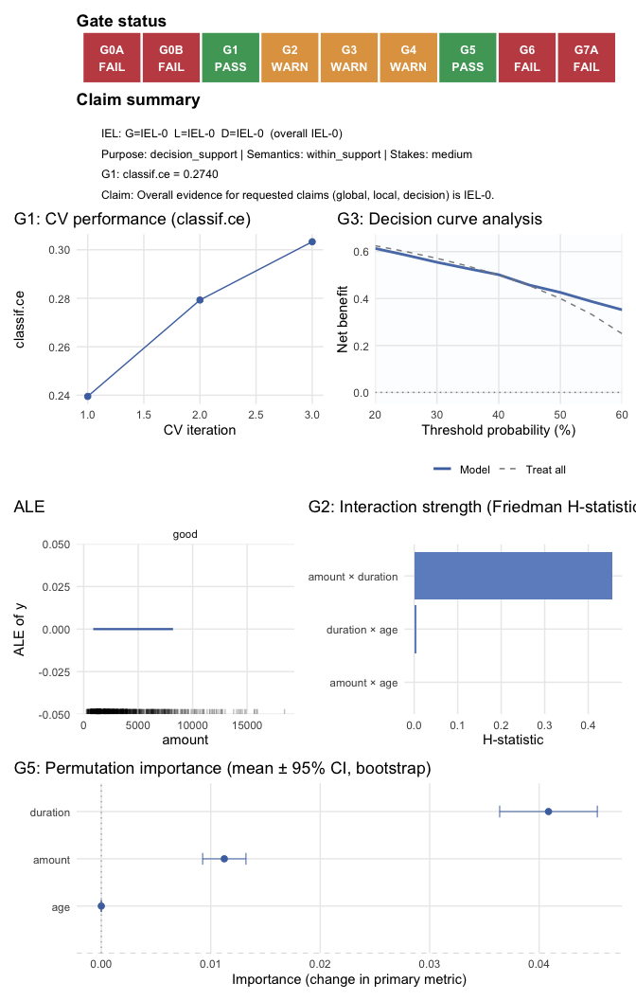
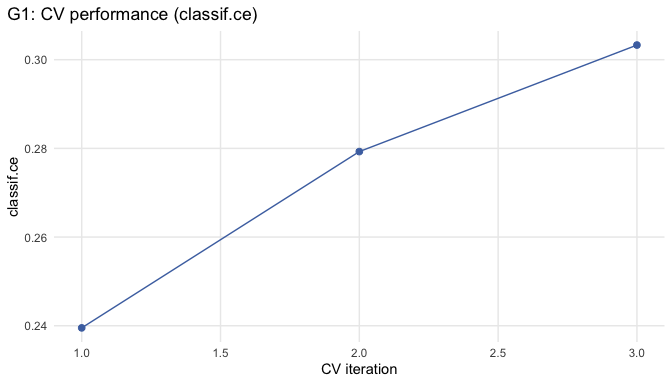
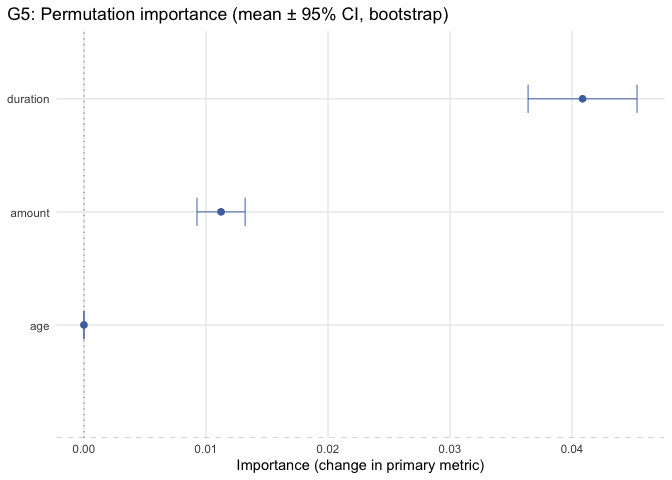
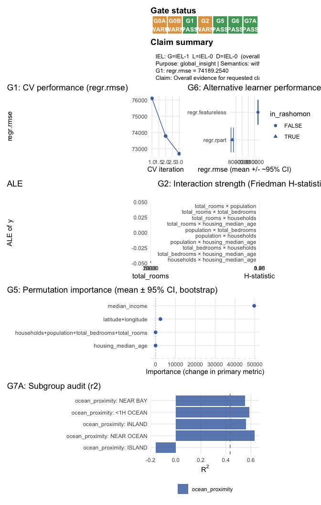
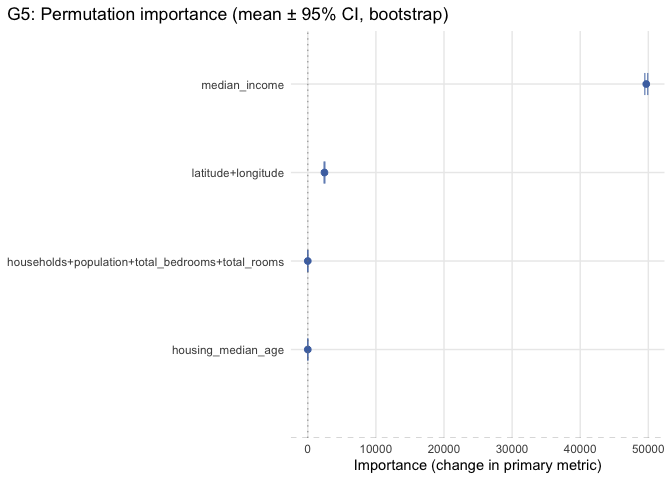
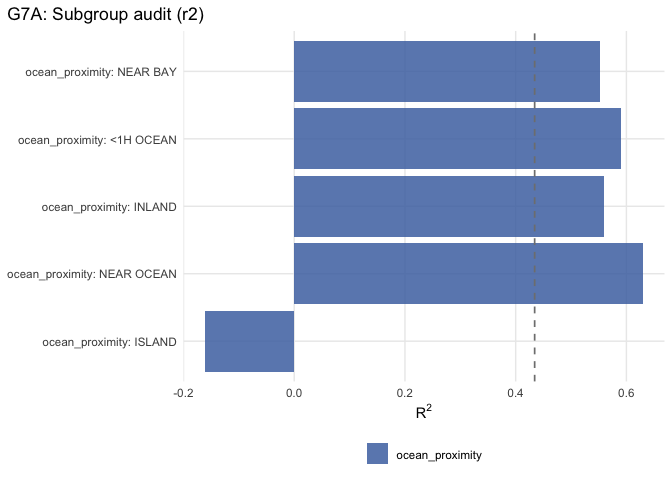

<!-- README.md is generated from README.Rmd. Please edit that file -->

# mlr3autoiml

`mlr3autoiml` is an **auditing and automation layer** for interpretable
machine learning (IML) on top of the **mlr3 ecosystem**. It implements a
**gate-based workflow** (G0A/G0B → G1 → G2 → G3 → G4 → G5 → G6 →
G7A/G7B) and assigns **claim-scoped Interpretation Evidence Levels
(IEL-0…3)** that scope the strength of permissible interpretive claims.

Core dependencies: `mlr3`, `mlr3measures`, `mlr3misc`, `data.table`,
`checkmate`, `R6`. Optional integrations (pipelines, SHAP, iml,
plotting) activate when the corresponding packages are available.

## Installation

``` r
# install.packages("remotes")
remotes::install_github("coorsaa/mlr3autoiml")
```

------------------------------------------------------------------------

## Example 1 — Classification · decision support

**Task:** `german_credit` (1 000 rows, 20 mixed-type features, binary
`credit_risk`). Full gate path including G3 calibration + decision
utility and G7A subgroup audit.

``` r
library(mlr3)
library(mlr3autoiml)

task    <- tsk("german_credit")
learner <- lrn("classif.rpart", predict_type = "prob", maxdepth = 6L)
```

``` r
auto <- AutoIML$new(
  task       = task,
  learner    = learner,
  resampling = rsmp("cv", folds = 3),
  purpose    = "decision_support",
  seed       = 42
)

auto$ctx$claim <- make_claim_card(
  purpose       = "decision_support",
  semantics     = "within_support",
  stakes        = "medium",
  claims        = list(global = TRUE, local = TRUE, decision = TRUE),
  decision_spec = list(
    thresholds = seq(0.20, 0.60, by = 0.05),
    utility    = list(tp = 1, fp = -0.5, fn = -1, tn = 0)
  ),
  target_population          = "Loan applicants, German Credit dataset",
  intended_use               = "Support credit-risk screening decisions.",
  prohibited_interpretations = "Causal claims; individual enforcement decisions."
)

auto$ctx$measurement        <- make_measurement_card("item")
auto$ctx$sensitive_features <- c("personal_status_sex", "foreign_worker")
auto$ctx$alt_learners       <- list(
  Featureless = lrn("classif.featureless", predict_type = "prob")
)
```

``` r
res <- auto$run()
```

``` r
knitr::kable(auto$report_card()[, .(gate_id, gate_name, status, summary)])
```

| gate_id | gate_name | status | summary |
|:---|:---|:---|:---|
| G0A | Scope claim & use | fail | Claim scope set (global=TRUE, local=TRUE, decision=TRUE) with semantics=within_support. |
| G0B | Measurement readiness | fail | Measurement readiness failed for high-stakes use: missing critical evidence (reliability, missingness_plan, scoring_pipeline, invariance). |
| G1 | Modeling and data validity (preflight) | pass | Predictive adequacy established with honest resampling. |
| G2 | What is being summarized? (dependence & interactions) | warn | Claim semantics=“within_support”: dependence and/or heterogeneity detected; prefer dependence- and interaction-aware summaries (ALE/ICE + regionalization) and avoid overinterpreting simple global narratives. |
| G3 | Calibration and decision utility | warn | Binary calibration/utility checks computed (intercept/slope, ECE, reliability, net benefit, cost-/utility sweep). |
| G4 | Faithfulness | warn | Faithfulness screened via linear surrogate (R^2=0.06) and local additive checks (Shapley max error=0.068). |
| G5 | Stability and robustness | pass | Permutation-based stability check suggests robust importance ordering under bootstrap perturbations. |
| G6 | Multiplicity and transport | fail | High-stakes claims require transport assessment in Gate 6, but transport evidence is missing. |
| G7A | Subgroups / measurement audit | fail | High-stakes subgroup claims require measurement comparability evidence (ctx$measurement$invariance). |

``` r
cat("\nIEL:  G =", res$iel$global, "| L =", res$iel$local,
        "| D =", res$iel$decision, "| overall =", res$iel$overall, "\n")
#> 
#> IEL:  G = IEL-0 | L = IEL-0 | D = IEL-0 | overall = IEL-0
```

``` r
auto$plot("overview")
```



``` r
auto$plot("g1_scores")
```



``` r
auto$plot("g2_effect", feature = "amount")
```


``` r
auto$plot("g3_dca")
```


``` r
auto$plot("g5_stability")
```



``` r
export_analysis_bundle(auto, dir = "bundle_german_credit", prefix = "german_credit")
```

------------------------------------------------------------------------

## Example 2 — Regression · global insight

**Task:** `california_housing` (20 640 rows, 8 numeric + 1 factor
feature, continuous `median_house_value`). Correlated spatial predictors
trigger ALE selection in G2; `ocean_proximity` serves as the subgroup
variable.

``` r
task    <- tsk("california_housing")
learner <- lrn("regr.rpart", maxdepth = 8L)
```

``` r
auto <- AutoIML$new(
  task       = task,
  learner    = learner,
  resampling = rsmp("cv", folds = 3),
  purpose    = "global_insight",
  seed       = 42
)

auto$ctx$claim <- make_claim_card(
  purpose           = "global_insight",
  semantics         = "within_support",
  stakes            = "low",
  claims            = list(global = TRUE, local = FALSE, decision = FALSE),
  target_population = "Californian housing blocks (1990 census)",
  intended_use      = "Identify global drivers of median house value.",
  prohibited_interpretations = "Causal claims; individual valuation."
)

auto$ctx$measurement        <- make_measurement_card("item")
auto$ctx$sensitive_features <- "ocean_proximity"
auto$ctx$alt_learners       <- list(Featureless = lrn("regr.featureless"))
```

``` r
res <- auto$run()
```

``` r
knitr::kable(auto$report_card()[, .(gate_id, gate_name, status, summary)])
```

| gate_id | gate_name | status | summary |
|:---|:---|:---|:---|
| G0A | Scope claim & use | warn | Claim scope set (global=TRUE, local=FALSE, decision=FALSE) with semantics=within_support. |
| G0B | Measurement readiness | warn | Measurement readiness screened (requires user-supplied psychometric evidence; missingness summarized). |
| G1 | Modeling and data validity (preflight) | pass | Predictive adequacy established with honest resampling. |
| G2 | What is being summarized? (dependence & interactions) | warn | Claim semantics=“within_support”: dependence and/or heterogeneity detected; prefer dependence- and interaction-aware summaries (ALE/ICE + regionalization) and avoid overinterpreting simple global narratives. |
| G5 | Stability and robustness | pass | Permutation-based stability check suggests robust importance ordering under bootstrap perturbations. |
| G6 | Multiplicity and transport | pass | Partial Gate 6 coverage: assessed multiplicity; not assessed transport. |
| G7A | Subgroups / measurement audit | pass | Subgroup audit computed (regression RMSE, R², mean_y by group). |

``` r
cat("\nIEL:  G =", res$iel$global, "| overall =", res$iel$overall, "\n")
#> 
#> IEL:  G = IEL-1 | overall = IEL-1
```

``` r
auto$plot("overview")
```



``` r
auto$plot("g2_effect", feature = "total_rooms")
```


``` r
auto$plot("g5_stability")
```



``` r
auto$plot("g7a_subgroups")
```



``` r
export_analysis_bundle(auto, dir = "bundle_california", prefix = "california")
```

------------------------------------------------------------------------

## Gate overview

| Gate | Triggered when | Evidence checks |
|----|----|----|
| G0A | always | Claim and semantics declaration; hard-stop on `causal_recourse` without identification |
| G0B | always | Measurement readiness; reliability / invariance evidence for high-stakes |
| G1 | always | CV performance + calibration snapshot |
| G2 | always | Feature dependence · ALE vs PDP selection · pairwise interaction screening |
| G3 | `claims$decision = TRUE` | Calibration curve + Decision Curve Analysis |
| G4 | `claims$local = TRUE` | SHAP faithfulness + perturbation sensitivity checks |
| G5 | always | Stability of narrated patterns under bootstrap resampling |
| G6 | high-resolution profile | Rashomon multiplicity + transport probes |
| G7A | `sensitive_features` set | Subgroup performance + calibration audit |
| G7B | user-facing + high-stakes | Human-factors (task-based evaluation) evidence |

IELs (0–3) are assigned per claim scope (global / local / decision). The
overall IEL is the minimum across all requested scopes.

## Status

The package follows a claim-first, gate-based architecture with explicit
semantics, claim-scoped IELs, and evidence-driven gate planning. Default
runs use the `high_resolution` profile; `quick_start = TRUE` is
available for rapid prototyping. IEL-3 requires G6 evidence across all
scopes and, for decision claims, a passed G7A subgroup audit.

## License

LGPL-3.
