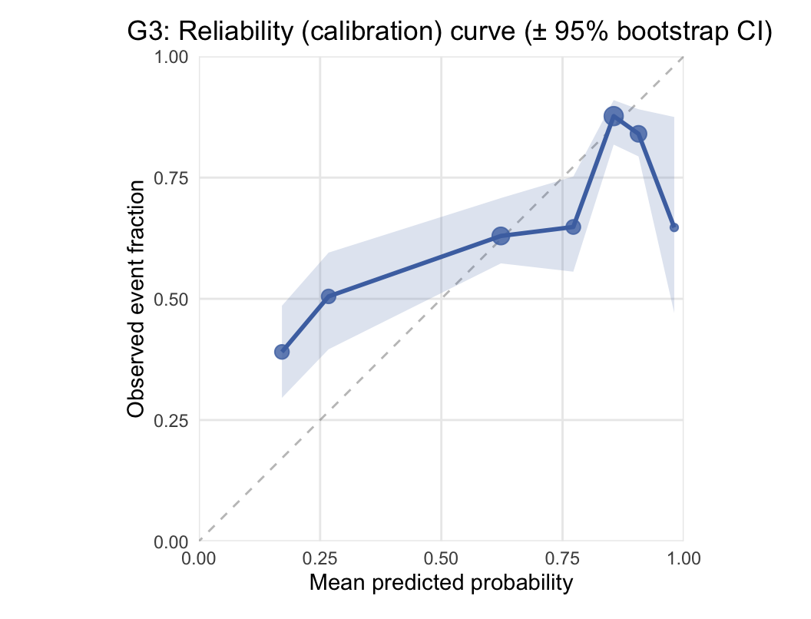
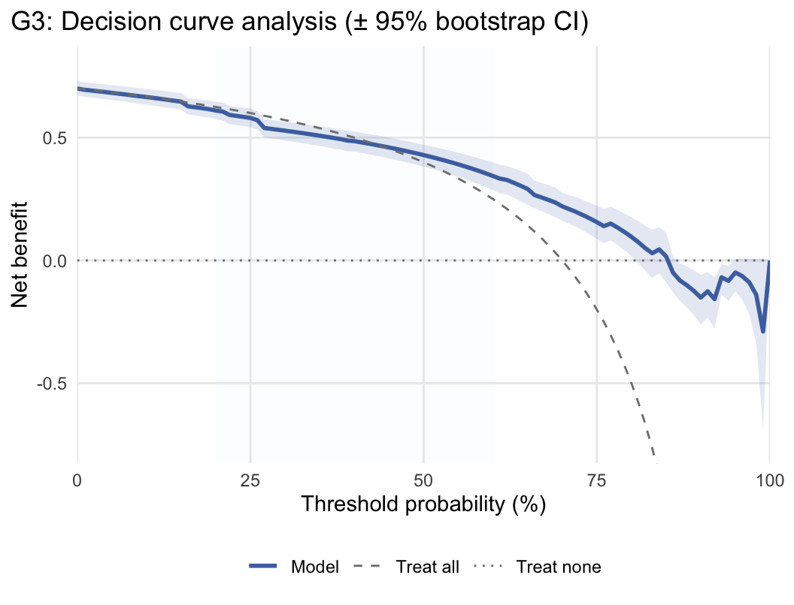
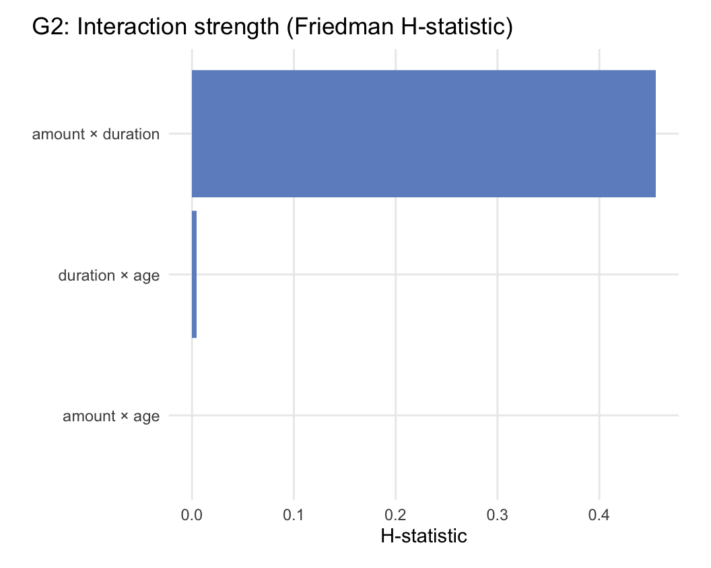
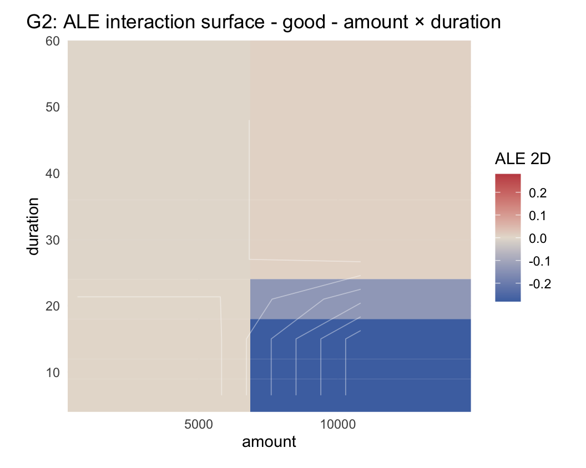
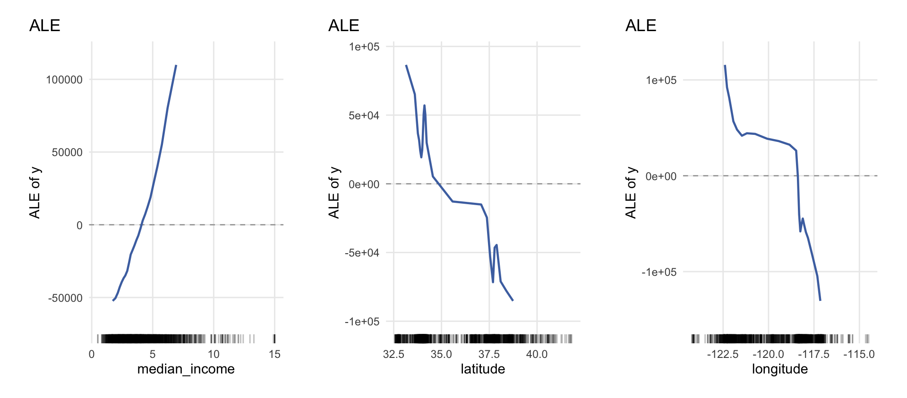
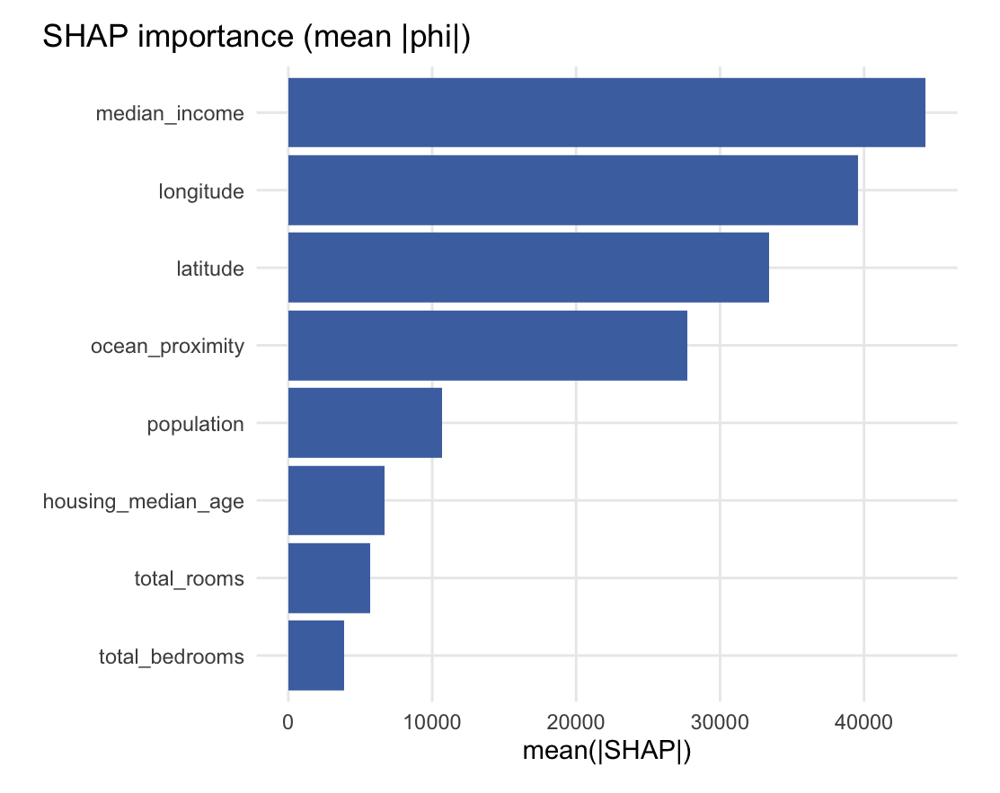
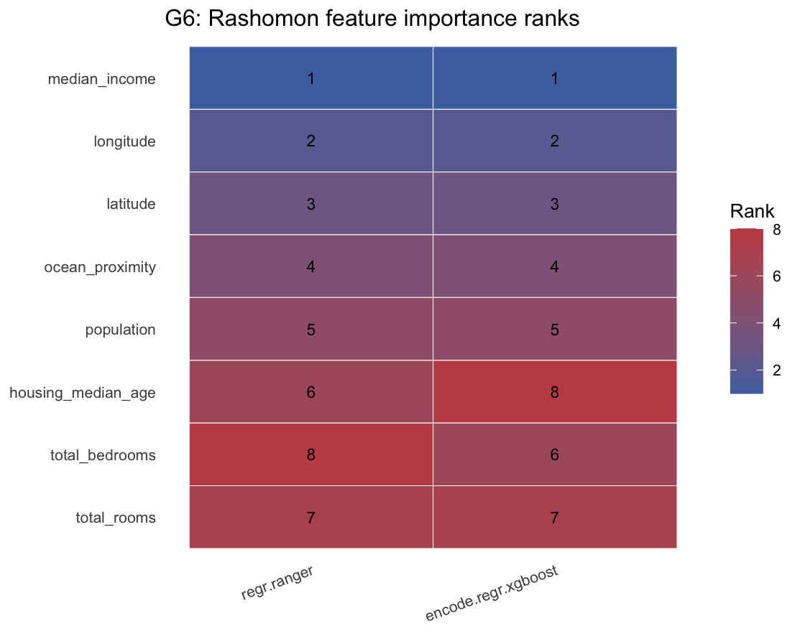

<!-- README.md is generated from README.Rmd. Please edit that file -->

# mlr3autoiml

`mlr3autoiml` 0.1.1 primarily implements **claim-scoped diagnostic gates
(CSDG)** for interpretable machine-learning analyses in the **mlr3
ecosystem**. A CSDG audit records the intended claim, measurement and
preprocessing choices, explanation semantics, gate-specific evidence,
and the limits of the resulting interpretation. Module availability,
evidence role, result direction, criterion provenance, materiality, and
claim consequence are separate fields. CSDG does not calculate an
aggregate score, readiness grade, or Interpretation Evidence Level, and
it does not certify causal validity, fairness, or deployment readiness.
Claims use exactly three inference levels (`functional`, `predictive`,
and `substantive`). A separate `use_claim` flag records whether the
proposition additionally asserts adequacy for an audience, workflow,
implementation, or use.

The claim-scoped interface distinguishes calibration from utility
(G3a/G3b), model multiplicity from setting transport (G6a/G6b), and
technical subgroup behavior from audience and workflow evidence
(G7a/G7b). The earlier combined gate names below belong only to the
retained `AutoIML` compatibility interface.

The claim object is `C = (T, M, S, D, U, Q)`: target, model scope,
explanation semantics, analytic distribution and measurement context,
intended use, and explanation design. `csdg_claim_relation()` records
`same`, `narrower`, `broader`, or `alternative_or_incomparable` for
every coordinate; no relation is inferred from text. Evidence roles are
exactly `necessary_requirement`, `potential_defeater`, `graded_support`,
and `descriptive_context`. `csdg_evidence_record()` keeps those roles
distinct from completion and results, and `csdg_adjudicate_claim()`
applies conditional non-compensation without adding evidence into a
score.

Core dependencies: `mlr3`, `mlr3measures`, `mlr3misc`, `data.table`,
`checkmate`, `R6`. Optional integrations (pipelines, SHAP, iml,
plotting) activate when the corresponding packages are available.

## Installation

``` r
# install.packages("remotes")
remotes::install_github("coorsaa/mlr3autoiml")
```

## CSDG quick start

Declare the claim and its scope before running the audit. This example
requests descriptive held-out performance, calibration, and global
permutation-importance evidence for one selected model in the analytic
sample. Because it supplies no use-linked adequacy criterion, the
corresponding adequacy questions remain unresolved.

``` r
library(mlr3)
library(mlr3autoiml)
library(mlr3learners)

task = tsk("german_credit")
learner = lrn("classif.rpart", predict_type = "prob", maxdepth = 6L)

claim = csdg_claim(
  id = "credit_risk_description",
  statement = paste(
    "Held-out predictive performance, calibration, and global permutation importance",
    "are described for the selected model in the analytic sample."
  ),
  claim_type = c("predictive_performance", "calibration", "global_explanation"),
  target = "credit risk",
  unit = "credit application",
  population = "applications represented by the analytic sample",
  analytic_distribution = "the observed German credit example data",
  model_scope = "selected_model",
  setting_scope = "analytic_sample",
  scientific_use = "descriptive model audit",
  explanation_design = "held-out marginal permutation importance"
)

measurement = csdg_measurement(
  outcome = task$target_names,
  predictors = task$feature_names,
  data_source = "mlr3 German credit example task",
  sample_definition = "all rows in the example task",
  unit = "credit application",
  missingness = "no missing values in the supplied task",
  preprocessing = "the complete learner is refitted within every training split",
  verification = list(status = "not_checked")
)

explanation = csdg_explanation(
  method_ids = "pfi",
  scope = "global",
  target = "positive-class probability"
)

audit = csdg_audit(
  task = task,
  learner = learner,
  claim = claim,
  measurement = measurement,
  explanation = explanation,
  config = csdg_config(
    seed = 42L,
    resampling = list(folds = 3L, repeats = 1L),
    stability = list(pfi_repetitions = 3L)
  )
)

csdg_report_card(audit)
csdg_claim_report(audit)
bundle = csdg_export(audit, path = "csdg-output")
```

When a numerical criterion is appropriate, supply both the value and its
provenance. For example,
`performance = list(maximum_primary_score = value)` must be accompanied
by
`criteria = list(performance.maximum_primary_score = list(source = source, rationale = rationale))`.
Without both strings, the diagnostic remains descriptive and the module
decision is `unresolved`.

`csdg_rashomon()` is likewise descriptive by default. It returns
candidate performance without an accepted set unless an absolute or
relative tolerance and its source and rationale are supplied explicitly.

## Package and study-script boundary

The package owns reusable claim and evidence records, gate planning,
resampling, permutation importance, calibration, ALE bootstrap,
local-fidelity audits, importance agreement, matched-setting utilities,
plotting, reporting, and provenance. Study-specific equal-country
sampling, plausible-value loops, SHILD and PISA orchestration, country
exclusion schedules, matched-control scheduling, and manuscript
synthesis remain in the analysis scripts. No single package call
reproduces either complete empirical study.

Keep `output_dir = NULL` while inspecting an audit, and export to a
dedicated directory when it is ready. By default, `csdg_export()` omits
fitted models and observation-level predictions. This is not a privacy
or licensing clearance: review the generated bundle before sharing it,
and set `include_models = TRUE` or `include_predictions = TRUE` only
when its release is explicitly approved.

------------------------------------------------------------------------

## AutoIML compatibility examples

The earlier `AutoIML` interface remains available for compatibility. Its
`GateResult` pass/warn/fail/skip labels are heuristic workflow
diagnostics, not CSDG evidence roles or claim decisions. Printing a
legacy `GateResult` emits a targeted deprecation warning. The examples
below demonstrate that workflow; new analyses should start from the CSDG
claim-card and audit interface shown above.

### Example 1 — Classification · decision support

**Task:** `german_credit` (1 000 rows, 20 mixed-type features, binary
`credit_risk`). Full compatibility-gate path including combined G3
calibration and decision utility and G7A subgroup audit.

``` r
library(mlr3)
library(mlr3autoiml)
library(mlr3learners)
library(mlr3pipelines)

task = tsk("german_credit")
task$set_col_roles("personal_status_sex", add_to = "group")

learner = lrn("classif.rpart", predict_type = "prob", maxdepth = 6L)
```

The `ctx$claim` block is a pre-analysis declaration, not a model output.
The operative part is the claim scope, semantics, stakes, and any
decision thresholds. AutoIML can derive conservative defaults for
non-use, prohibited interpretations, and decision-policy wording from
those declarations, so you only need to spell them out when the analysis
warrants narrower boundaries.

``` r
auto = AutoIML$new(
  task = task,
  learner = learner,
  resampling = rsmp("cv", folds = 3),
  purpose = "decision_support",
  seed = 42
)

auto$ctx$claim = make_claim_card(
  purpose = "decision_support",
  semantics = "within_support",
  stakes = "medium",
  claims = list(global = TRUE, local = FALSE, decision = TRUE),
  decision_spec = list(
    thresholds = seq(0.20, 0.60, by = 0.05),
    utility = list(tp = 1, fp = -0.5, fn = -1, tn = 0)
  )
)

auto$ctx$measurement = make_measurement_card(
  level = "item"
)
auto$ctx$sensitive_features = "personal_status_sex"
auto$ctx$alt_learners = list(
  featureless = lrn("classif.featureless", predict_type = "prob")
)
auto$ctx$multiplicity$transport_mode = "group_performance"
```

The measurement card now only needs the part the analysis cannot infer
reliably. Here that is just the measurement level. Gate 0B derives task-
and pipeline-level notes for missingness and scoring automatically, and
only asks for comparability or reliability evidence when the measurement
type makes those claims material.

``` r
auto$run()
```

``` r
knitr::kable(auto$report_card()[, .(gate_id, gate_name, status, summary)])
```

| gate_id | gate_name | status | summary |
|:---|:---|:---|:---|
| G0A | Scope claim & use | pass | Claim scope set (global=TRUE, local=FALSE, decision=TRUE) with semantics=within_support. |
| G0B | Measurement readiness | pass | Measurement readiness screened (psychometric evidence is user-supplied when needed, and pipeline notes may be analysis-derived). |
| G1 | Modeling and data validity (preflight) | pass | Predictive adequacy established with honest resampling. |
| G2 | What is being summarized? (dependence & interactions) | pass | Claim semantics=“within_support”: dependence and/or heterogeneity detected; Gate 2 passes with claim restrictions: prefer dependence- and interaction-aware summaries (ALE/ICE + regionalization) and avoid overinterpreting simple global narratives. |
| G3 | Calibration and decision utility | warn | Binary calibration and decision-utility diagnostics were computed. Calibration adequacy remains unadjudicated because no claim-specific criteria were declared. |
| G5 | Stability and robustness | pass | Permutation-based stability check suggests robust importance ordering under bootstrap perturbations. |
| G6 | Multiplicity and transport | pass | Multiplicity and transport checks did not raise major concerns (given available evidence). |
| G7A | Subgroups / measurement audit | pass | Subgroup audit computed (binary classification performance and calibration; utility if specified). Calibration estimates are descriptive unless claim-specific adequacy criteria are supplied elsewhere. |

With the operative claim card, analysis-derived measurement notes, and
subgroup audit in place, the remaining warnings are substantive rather
than setup-related: calibration, net benefit in the declared threshold
range, and the interaction pattern that makes a simple one-feature story
too thin.

``` r
auto$plot("g3_calibration")
auto$plot("g3_dca")
```



Gate 2 then shows why the package warns instead of presenting a single
global effect curve as the main story: `amount` and `duration` dominate,
and they interact strongly.

``` r
auto$plot("g2_hstats", top_n = 3L)
auto$plot("g2_ale_2d", feature1 = "amount", feature2 = "duration", class_label = task$positive)
```



When Gate 2 regionalization is enabled
(`auto$ctx$structure$regionalize = TRUE`) and the interaction screen
finds materially heterogeneous effects, the GADGET-style views decompose
the global effect into interpretable regions and show the split rules
that produced those regions. If no such regions are found, the
paper-aligned Gate 2 evidence remains the global effect plot, the
interaction screen, and the top 2D ALE surface. Optional
`pint_enabled = TRUE` adds a permutation-based interaction screen before
regionalization.

``` r
if (!is.null(auto$result$gate_results$G2$artifacts$gadget_regions) &&
    nrow(auto$result$gate_results$G2$artifacts$gadget_regions) > 0L) {
  auto$plot("g2_gadget")
  auto$plot("g2_gadget_tree")
}
auto$plot("g2_pint")
```

``` r
export_analysis_bundle(auto, dir = "bundle_german_credit", prefix = "german_credit")
```

------------------------------------------------------------------------

### Example 2 — Regression · global insight

**Task:** `california_housing` (20 433 complete cases from the 20
640-row benchmark, 8 numeric + 1 factor feature, continuous
`median_house_value`). We use a complete-case subset so `ranger`, lasso,
and `xgboost` benchmark the same design matrix. Correlated spatial
predictors still trigger ALE selection in G2, and the mixed learner
family makes Gate 6 Rashomon diagnostics realistic.

``` r
task = tsk("california_housing")
task$filter(task$row_ids[stats::complete.cases(task$data())])

learner = lrn(
  "regr.ranger",
  num.trees = 200L,
  mtry.ratio = 0.5,
  min.node.size = 5L
)
```

The claim card here is not extra decoration; it fixes the semantics and
scope before Gate 6 compares models. Analysis-specific transport and
preprocessing notes can remain implicit unless you need to declare a
narrower boundary than the task- and pipeline-level defaults.

``` r
auto = AutoIML$new(
  task = task,
  learner = learner,
  resampling = rsmp("cv", folds = 3),
  purpose = "global_insight",
  seed = 42
)

auto$ctx$claim = make_claim_card(
  purpose = "global_insight",
  semantics = "within_support",
  stakes = "low",
  claims = list(global = TRUE, local = FALSE, decision = FALSE)
)

auto$ctx$measurement = make_measurement_card(
  level = "item"
)
auto$ctx$sensitive_features = "ocean_proximity"
auto$ctx$alt_learners = list(
  lasso = as_learner(po("encode") %>>% lrn("regr.glmnet", alpha = 1)),
  xgboost = as_learner(
    po("encode") %>>%
      lrn(
        "regr.xgboost",
        nrounds = 150L,
        eta = 0.05,
        max_depth = 6L,
        subsample = 0.8,
        colsample_bytree = 0.8,
        verbose = 0
      )
  ),
  tree = lrn("regr.rpart", maxdepth = 12L, cp = 1e-03),
  featureless = lrn("regr.featureless")
)
auto$ctx$structure$max_features = 8L
```

``` r
auto$run()
```

``` r
knitr::kable(auto$report_card()[, .(gate_id, gate_name, status, summary)])
```

| gate_id | gate_name | status | summary |
|:---|:---|:---|:---|
| G0A | Scope claim & use | pass | Claim scope set (global=TRUE, local=FALSE, decision=FALSE) with semantics=within_support. |
| G0B | Measurement readiness | pass | Measurement readiness screened (psychometric evidence is user-supplied when needed, and pipeline notes may be analysis-derived). |
| G1 | Modeling and data validity (preflight) | pass | Predictive adequacy established with honest resampling. |
| G2 | What is being summarized? (dependence & interactions) | pass | Claim semantics=“within_support”: dependence and/or heterogeneity detected; Gate 2 passes with claim restrictions: prefer dependence- and interaction-aware summaries (ALE/ICE + regionalization) and avoid overinterpreting simple global narratives. |
| G5 | Stability and robustness | pass | Permutation-based stability check suggests robust importance ordering under bootstrap perturbations. |
| G6 | Multiplicity and transport | warn | Evidence of multiplicity (Rashomon set contains multiple near-tie models) and/or limited transportability across groups; scope interpretive claims accordingly. |
| G7A | Subgroups / measurement audit | pass | Subgroup audit computed (regression RMSE, R², mean_y by group). |

The effect plots focus on the housing variables that dominate the model
story: income and coastal location. `ranger` keeps the global effects
readable, while Gate 6 benchmarks it against lasso, `xgboost`, and a
single tree baseline.

``` r
auto$plot("g2_effect", feature = c("median_income", "latitude", "longitude"))
```



The supporting views below add two complementary angles: conditional
SHAP importance for the fitted tree, and a Rashomon rank heatmap for the
near-tie models in Gate 6.

``` r
auto$plot("shap_importance", n_rows = 40L, sample_size = 15L, background_n = 40L, top_n = 8L)
auto$plot("g6_rank_heatmap", top_n = 8L)
```



``` r
export_analysis_bundle(auto, dir = "bundle_california", prefix = "california")
```

------------------------------------------------------------------------

## AutoIML gate overview

This table documents the legacy compatibility interface; it is not the
CSDG applicability map returned by `csdg_gate_plan()`.

| Gate | Triggered when | Evidence checks |
|----|----|----|
| G0A | always | Claim and semantics declaration; hard-stop on `causal_recourse` without identification |
| G0B | always | Measurement readiness; reliability / invariance evidence for high-stakes |
| G1 | always | CV performance + calibration snapshot |
| G2 | always | Feature dependence · ALE vs PDP selection · pairwise interaction screening |
| G3 | `claims$decision = TRUE` | Calibration curve + Decision Curve Analysis |
| G4 | `claims$local = TRUE` | SHAP faithfulness + perturbation sensitivity checks |
| G5 | always | Stability of narrated patterns under bootstrap resampling |
| G6 | high-resolution profile | Rashomon multiplicity + transport probes |
| G7A | `sensitive_features` set | Subgroup performance + calibration audit |
| G7B | user-facing + high-stakes | Human-factors (task-based evaluation) evidence |

## AutoIML compatibility status

The compatibility workflow uses a claim-first, gate-based architecture
with explicit semantics, direct gate evidence, and claim-dependent gate
planning. Default compatibility runs use the `high_resolution` profile;
`quick_start = TRUE` is available for rapid prototyping. Report cards
and guides retain the individual gate results and their claim-specific
restrictions instead of reducing them to a summary evidence score.

## License

LGPL-3.
