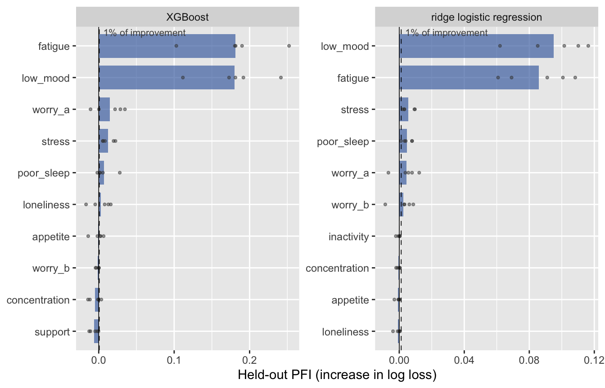

<!-- README.md is generated from README.Rmd. Please edit that file -->

# mlr3autoiml

`mlr3autoiml` helps researchers decide whether the evidence supports a
conclusion that they draw from an explanation of a machine learning
model, such as “the model relies mainly on self-rated health.” It
implements **Claim-Scoped Diagnostic Gates (CSDG)** for the **mlr3
ecosystem**. An analysis runs in its usual order:

1.  **Fit** learners and a model without predictors on the same
    cross-validation splits with `mlr3::benchmark()` (`csdg_fit()`).
2.  **Look** at held-out permutation feature importance (PFI), also
    grouped and conditional (`csdg_importance()`), or at accumulated
    local effects (`csdg_effect()`).
3.  **State a claim** that the result suggests (`claim_relies_mainly()`,
    `claim_top_k()`, `claim_order()`, `claim_direction()`).
4.  **Check it**: the package derives the properties that the claim
    requires from the 12 gates of the article and computes the default
    checks (`csdg_check()`).
5.  **Assess it** with a fixed decision rule (`csdg_assess()`) and test
    it on new data with the same criteria (`csdg_confirm()`).

The package writes the claim, its scope, the criteria, and the
observations from the computations. Properties that cannot be computed,
such as validity evidence for a construct, are entered with
`csdg_judge()`. Favorable results never offset a contradicted property,
and no aggregate score is computed. Claims, scopes, and evidence can
also be recorded by hand (`csdg_claim()`, `csdg_evidence_record()`,
`csdg_adjudicate_claim()`).

| Term | Values |
|----|----|
| Scope elements | quantity, model, procedure, data, meaning (model description, population claim, causal claim), use |
| Evidence roles | required property, established counterevidence, unresolved threat, context |
| Status of a required property | supported, contradicted, open |
| Assessment of a claim | not met if a required property is contradicted; otherwise unresolved if one is open; otherwise met |
| Decision | a met claim is retained; a claim that is not met or unresolved is revised or withheld |

## Installation

Install the current version from GitHub:

``` r
remotes::install_github("coorsaa/mlr3autoiml", build_vignettes = TRUE)
library(mlr3autoiml)
```

Released versions are tagged, for example
`remotes::install_github("coorsaa/mlr3autoiml@v0.2.0")`.

## Quick start

A simulated survey of 500 respondents has 12 items and a binary outcome.
Two scale scores, `low_mood` and `fatigue`, predict it strongly;
`worry_a` and `worry_b` are two wordings of one worry item; three items
have weak effects and five none.

``` r
library(mlr3)
library(mlr3learners)
library(mlr3autoiml)
library(data.table)

simulate_survey = function(n, seed) {
  set.seed(seed)
  items = c("low_mood", "fatigue", "worry_a", "worry_b", "poor_sleep", "stress", "loneliness", "inactivity",
    "appetite", "concentration", "support", "optimism")
  x = as.data.table(matrix(rnorm(n * 12), n, 12, dimnames = list(NULL, items)))
  worry = rnorm(n)
  x[, worry_a := as.integer(cut(worry + rnorm(n, sd = 0.3), c(-Inf, -1.2, -0.4, 0.4, 1.2, Inf)))]
  x[, worry_b := pmin(5L, pmax(1L, worry_a + ifelse(runif(n) < 0.02, sample(c(-1L, 1L), n, TRUE), 0L)))]
  eta = -0.3 + 1.2 * x$low_mood + 1.1 * x$fatigue + 0.7 * worry + 0.3 * x$poor_sleep + 0.2 * x$stress +
    0.15 * x$loneliness
  x[, low_wellbeing := factor(rbinom(n, 1, plogis(eta)), levels = c(0, 1))]
  as_task_classif(x, target = "low_wellbeing", positive = "1", id = "survey")
}
task = simulate_survey(500L, seed = 3L)
```

**Fit and look.** XGBoost and ridge logistic regression are fitted on
the same five folds as a model without predictors; held-out PFI is the
increase in held-out log loss when one predictor is permuted. Common
learners are labeled by their method in all generated text.

``` r
learners = list(
  xgboost = lrn("classif.xgboost", nrounds = 100, eta = 0.1, max_depth = 3, predict_type = "prob"),
  ridge = lrn("classif.cv_glmnet", alpha = 0, nfolds = 5, predict_type = "prob")
)
fits = csdg_fit(task, learners, folds = 5, seed = 1)
imp = csdg_importance(fits, repetitions = 10, seed = 2)
imp
#> <CSDGImportance> held-out PFI, increase in log loss; 5 folds x 10 permutations
#> XGBoost: held-out log loss 0.607 versus 0.681 for the model without predictors (improvement 0.0743)
#>   predictor    mean PFI   relative to improvement   folds in top 2
#>   fatigue         0.181                      244%              5/5
#>   low_mood        0.180                      242%              5/5
#>   worry_a        0.0149                       20%              0/5
#>   stress         0.0123                       17%              0/5
#>   poor_sleep     0.0069                      9.3%              0/5
#>   loneliness     0.0030                      4.1%              0/5
#>   ... 6 more predictors
#> ridge logistic regression: held-out log loss 0.560 versus 0.681 for the model without predictors (improvement 0.121)
#>   predictor    mean PFI   relative to improvement   folds in top 2
#>   low_mood       0.0950                       79%              5/5
#>   fatigue        0.0860                       71%              5/5
#>   stress         0.0055                      4.5%              0/5
#>   poor_sleep     0.0048                      4.0%              0/5
#>   worry_a        0.0046                      3.8%              0/5
#>   worry_b        0.0025                      2.1%              0/5
#>   ... 6 more predictors
#> Folds in top 2: folds in which the predictor has one of the 2 largest PFI values (print(imp, k = )).
#> PFI values are not parts of the improvement, so PFI relative to the improvement can exceed 100%.
```

``` r
plot(imp)
```



**Claim, check, and assess.** The result suggests that XGBoost relies
mainly on `low_mood` and `fatigue`. `claim_relies_mainly()` states the
claim, `csdg_check()` computes the properties that it requires, and
`csdg_assess()` applies the decision rule.

``` r
claim = claim_relies_mainly(imp, k = 2, factor = 2, learners = "xgboost")
chk = csdg_check(claim, imp)
chk
#> <CSDG check> XGBoost relies mainly on fatigue and low_mood.
#> Criteria (defaults, see ?csdg_check): minimum importance 1% of the improvement;
#> at least 5 of 5 folds; Monte Carlo rule; corrected 95% interval must clear the
#> smallest relevant difference.
#> gate  check               status        observation
#> G0a/b scope               supported     The six scope elements are generated
#>                                         from the analysis; the claim names
#>                                         analyzed variables, not constructs.
#> G1    performance         context       Held-out log loss 0.607 versus 0.681
#>                                         for the model without predictors
#>                                         (improvement 0.0743, 11%); 4 of 5 folds
#>                                         improve.
#> G2    content             supported     fatigue 0.181 and low_mood 0.180 versus
#>                                         0.0149 for worry_a, the largest other
#>                                         predictor (12.2 and 12.0 times); margin
#>                                         (PFI minus 2 x PFI of worry_a) 0.152
#>                                         [0.0576, 0.246] and 0.150 [0.0779,
#>                                         0.222]. Against the largest other
#>                                         predictor of each fold, which can
#>                                         differ between folds: 0.134 [0.0448,
#>                                         0.223] and 0.133 [0.0432, 0.222].
#> G2    minimum importance  supported     fatigue 0.181 (244%) and low_mood 0.180
#>                                         (242%) of the improvement of 0.0743
#>                                         (0.681 to 0.607).
#> G2    procedure           supported     Held-out marginal PFI with log loss, 10
#>                                         permutations per fold in 5 folds, as
#>                                         the scope names. No grouped or
#>                                         conditional comparison was requested.
#> G5    stability           supported     Selected anew in each fold: 5 of 5
#>                                         folds reproduce the result (cutoff 1: 0
#>                                         of 5; cutoff 3: 1 of 5).
#> G6a   other learner       context       ridge logistic regression: the result
#>                                         also holds (fatigue 0.0860 and low_mood
#>                                         0.0950 versus 0.0055 for stress).
csdg_assess(chk)
#> <CSDG assessment> XGBoost relies mainly on fatigue and low_mood.
#>   Met (exploratory)
#>   Specification (G0a) supported | Measurement (G0b) supported | Content (G2)
#>   supported | Minimum importance (G2) supported | Procedure (G2) supported |
#>   Stability (G5) supported
#>   On average, fatigue and low_mood have 12.2 and 12.0 times the PFI of the
#>   largest other predictor, worry_a; the result recurs in 5 of 5 folds. The
#>   claim was formulated after the explanation was inspected; it is established
#>   only after a test on new data (csdg_confirm()).
#>   Decision options: retain
```

The claim was formulated after the explanation was inspected, so its
assessment is exploratory; `csdg_confirm(chk, new_task)` fits the same
learners to new data and applies the claim with the same criteria.

## Learn more

- **[Checking what an explanation
  shows](https://stefancoors.de/mlr3autoiml/articles/exploratory_workflow.html)**
  (`vignette("exploratory_workflow", package = "mlr3autoiml")`) works
  through the simulated survey with 1,000 respondents: a claim that is
  met, a claim about the two wordings that conditional PFI contradicts,
  a direction, and the test on new data.
- **[The numerical example of the
  article](https://stefancoors.de/mlr3autoiml/articles/claim_scoped_diagnostic_gates.html)**
  (`vignette("claim_scoped_diagnostic_gates", package = "mlr3autoiml")`)
  assesses the three claims of the article’s numerical example.
- **[The function
  reference](https://stefancoors.de/mlr3autoiml/reference/index.html)**
  documents every function, including the diagnostics of `csdg_audit()`
  and the local surrogate described in `?csdg_diagnostics`.
- `csdg_claim_record_template()` returns the blank claim record of the
  article as a table to fill in, and `supported()`, `contradicted()`,
  and `open_status()` return the three property statuses.
- Labels of versions before 0.1.6 still work with a deprecation warning;
  see [the migration
  note](https://github.com/coorsaa/mlr3autoiml/blob/main/inst/MIGRATION_0_1_6.md)
  and [the
  changelog](https://stefancoors.de/mlr3autoiml/news/index.html).

## Diagnostics in an mlr3 workflow

`csdg_audit()` derives the gate plan and computes the diagnostics of an
mlr3 learner: held-out performance, dependence and support, calibration,
decision curves, cross-fitted local fidelity, stability of held-out PFI,
comparisons with similarly accurate models, leave-one-setting-out
refits, and subgroup results. `csdg_report_card()` lists the gates with
the status of each required property, and `csdg_claim_report()` applies
the decision rule to the audit and to evidence records that the
researcher supplies. A numerical criterion needs a source and a
rationale; without them, the property remains open. By default,
`csdg_export()` omits fitted models and observation-level predictions;
review the generated bundle before sharing it.

## The accompanying article

Version 0.1.0 produced the primary analyses of the accompanying article.
The scripts of its two empirical applications are kept in a separate
analysis repository.

## Legacy AutoIML workflow

The earlier `AutoIML` interface remains available for compatibility. Its
gate identifiers and pass/warn/fail/skip labels are separate from the
CSDG gate registry and vocabulary. Its examples and gate overview are in
[the legacy AutoIML
article](https://stefancoors.de/mlr3autoiml/articles/legacy_autoiml.html)
(`vignette("legacy_autoiml", package = "mlr3autoiml")`); new analyses
start from the CSDG interface above.

## License

LGPL-3.
